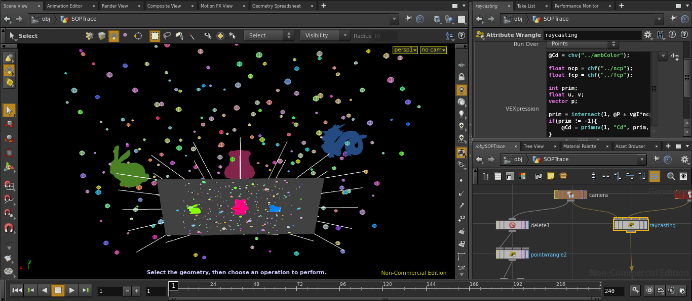
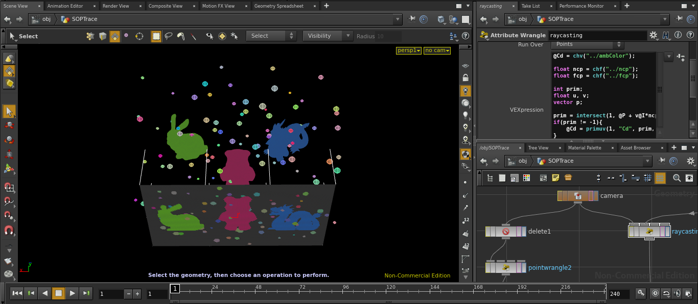
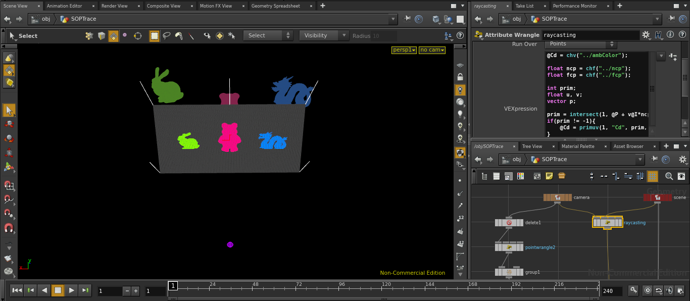
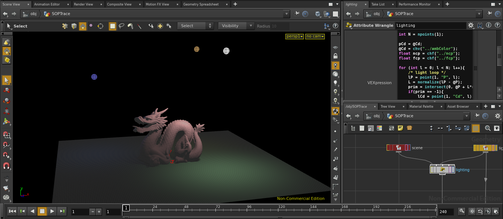
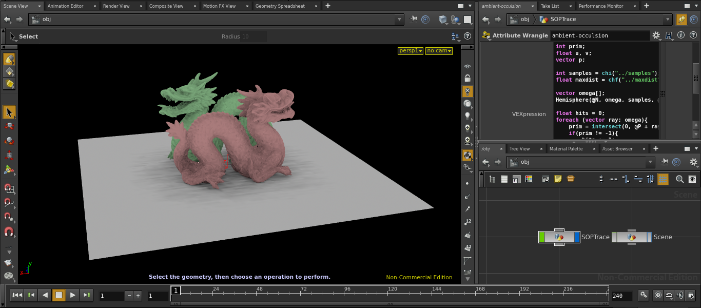
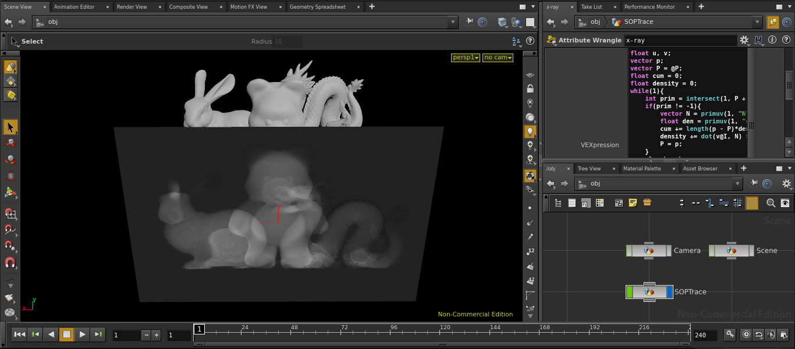

# SOPTracing

Rendering techniques applied and visualized in the SOP context, just for fun.

(_Extreme use of **intersect** function_)

## Camera Models

### Fisheye

### Orthographic

### Perspective

## Light Models

### Point

## Shading Models

### Ambient Occlusion RTAO

### x-ray

